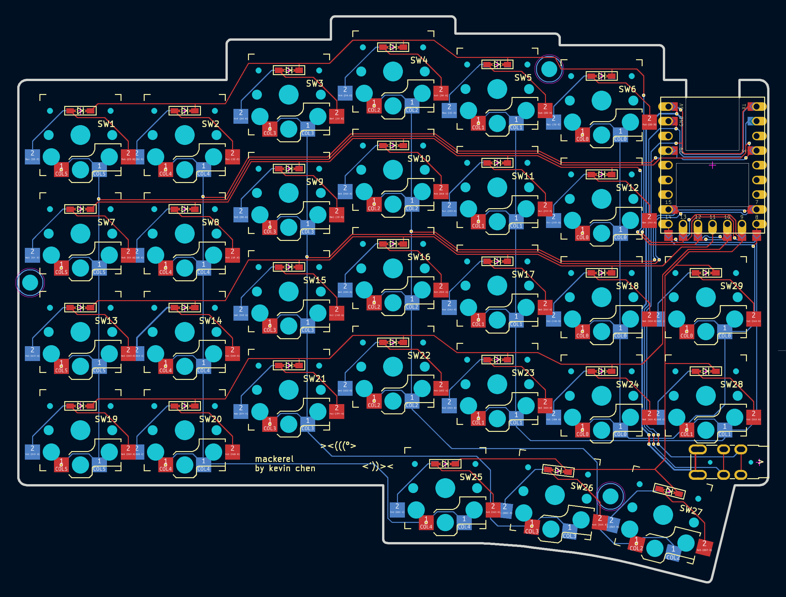

# mackerel

mackerel is a 58 key (6x4+5 split) column-staggered choc-spaced split ergonomic keyboard. mackerel is a successor to [calico](https://github.com/inchkev/calico), my first split keyboard.

- rp2040-zero based
- reversible pcb

## board

## to build mackerel, you'll need:

* 2x mackerel pcbs
* 2x waveshare rp2040-zero or similar
* 58x choc v1 switches
* 58x choc 1u keycaps (I used MBK profile)
* 58x Kailh choc hotswap sockets
* 58x SOD-123 diodes (I used 1N4148W)
* 2x TRRS PJ-320A jacks
* 1x TRRS cable
* 1x usb-c cable
* 3d printed enclosure (wip...)

## mackerel was inspired by

* [calico](https://github.com/inchkev/calico) and all its inspirations
* [pluckey by floookay](https://github.com/floookay/pluckey)
* [TOTEM by GEIGEIGEIST](https://github.com/GEIGEIGEIST/TOTEM)

### and licensed under

[CERN-OHL-W-2.0](https://spdx.org/licenses/CERN-OHL-W-2.0.html) overall. mackerel uses footprints, modified and unmodified, under different licenses. see [ATTRIBUTIONS.md](ATTRIBUTIONS.md).